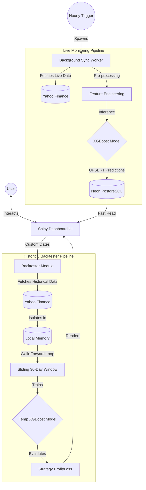

# API-Driven US Stock Market Prediction & Backtesting Engine

This Shiny application fetches real-time stock data via the **Yahoo Finance API**, performs **feature engineering**, and applies an advanced **XGBoost machine learning model** to predict the closing price of top US stocks (AAPL, AMZN, MSFT, GOOGL, NVDA) for the **next trading day**.

It features a dual-architecture system:
1. **Live Monitoring**: Tracks real-time predictions, simulates a live Long/Short trading strategy, and permanently logs predictions via `UPSERT` to a secure **Neon PostgreSQL cloud database**.
2. **Historical Backtester**: A highly robust, offline sandbox to test the AI on any custom historical timeframe with mathematical guarantees against data leakage.

----------------------------------------------------------------------------------------------------------------------
# Live App (CLICK HERE): 
[https://sathyav99.shinyapps.io/API_US_stock_prediction/](https://sathyav99.shinyapps.io/API_US_stock_prediction/)
----------------------------------------------------------------------------------------------------------------------

---

## 📁 Clean Architecture

The repository is structured for production-grade reliability:
- `models/`: Stores the compiled XGBoost AI brains (`_XGB.rds`).
- `scripts/`: Development scripts and background sync processes (e.g., `sync_data.R`).
- `config/`: Secure, git-ignored configuration files (`credentials.R`, `shinyapps_auth.R`).
- `data/`: CSV data dumps.
- `app.R`: The core Shiny dashboard engine.

---

## 🏗️ System Architecture & Data Flow

The application follows a robust decoupled architecture, integrating a responsive frontend, a machine learning backend, and a cloud-native database.

### 1. System Architecture
- **Frontend (Shiny UI)**: Built with `shinydashboard` and `plotly`, providing a dual-tab interface for interactive visualization and real-time KPI tracking.
- **Backend ML Engine**: R-based data pipeline handling real-time data fetching (`quantmod`), feature engineering, and inference (`xgboost`). 
- **Cloud Database (Neon PostgreSQL)**: Acts as the central source of truth for persistent prediction logging. The UI reads pre-calculated metrics directly from Neon for blazing-fast load times.
- **Background Workers**: The Shiny app spawns asynchronous background R processes (e.g., `scripts/sync_data.R`) for heavy database synchronization, ensuring the main UI thread never freezes.

### 2. Data Flow (Live Monitoring)
1. **Trigger**: An asynchronous observer (`invalidateLater(3600000)`) polls hourly to check if the current market day requires a sync.
2. **Data Ingestion**: A background script queries the Yahoo Finance API for the latest stock prices.
3. **Feature Engineering**: Calculates 7, 14, and 20-day Moving Averages and Standard Deviations on the fly.
4. **AI Inference**: Loads the pre-trained `_XGB.rds` models and passes today's features to predict tomorrow's closing price.
5. **Cloud Upsert**: Performs an intelligent PostgreSQL `UPSERT` to the Neon database. It safely logs tomorrow's prediction while simultaneously updating today's *actual* closing price to evaluate past predictions.
6. **UI Render**: The dashboard reads the fresh predictions from Neon and instantly renders the Plotly charts, KPIs, and DataTables.

### 3. Data Flow (Historical Backtester)
1. **Sandbox Setup**: The user selects a custom date range. The system immediately isolates the data flow, bypassing the Neon cloud database to guarantee zero contamination of live tracking.
2. **Data Ingestion**: Pulls historical data directly from Yahoo Finance into localized server memory.
3. **Walk-Forward ML Pipeline**: Iterates sequentially through the test window. For *every single day* in the backtest, it dynamically trains a temporary, isolated XGBoost model using strictly the 30 days prior.
4. **Evaluation**: Predicts the target close, shifts the prediction forward by one day (`t+1`), and calculates simulated profit metrics.
5. **UI Render**: Updates the Sandbox UI tab with independent visualization widgets and performance logs.

---

## 🌟 Key Features

The dashboard operates on a dynamic multi-tab interface:

### Tab 1: Live Monitoring (Cloud Connected)
- **Top Header**: Dynamically displays the company name, absolute latest closing price, and exact date.
- **Advanced KPIs**: Calculates a simulated 30-Day Cumulative Profit strategy, Model Win Rate, Avg Daily Return, and counts accurate (✅) vs inaccurate (❌) vs pending (⏳) predictions.
- **Prediction Chart (5 Days)**: A line chart comparing the actual close prices to the model's predicted close prices, complete with explicit **UP** and **DOWN** markers.
- **Macro Trend Chart (60 Days)**: A classic Candlestick chart to provide visual context on recent momentum.
- **Neon Cloud Logging**: The app connects directly to Neon, generating 5 dedicated tables (e.g., `AAPL_predictions`). It runs an intelligent PostgreSQL `UPSERT` script to update today's actual close price while **strictly preserving** the historical prediction exactness via a `COALESCE` lock.

### Tab 2: Historical Backtester (Sandbox)
- **Walk-Forward ML Engine**: Replicates the Live Monitoring logic perfectly in history. The sandbox loops over your 15-day test window and dynamically trains a custom, temporary XGBoost model for *every single day* using the exact 30 days of data strictly prior to that specific day.
- **Dynamic Timeline Protection**: The UI automatically computes the exact IPO date of the selected company, preventing users from selecting backtest dates that lack sufficient historical data.
- **Zero Leakage Guarantee**: The engine generates predictions using only historical features, and physically shifts that prediction down by exactly 1 row (`preds[i] -> row[i+1]`). The AI is mathematically blinded to the future!
- **Visual Analytics**: Instantly generates Actual vs Predicted comparison graphs and Candlestick context charts directly in the sandbox.
- **Zero Cloud Impact**: The sandbox completely bypasses the Neon database, ensuring your live tracking is never contaminated by your experiments.

---

## ⚙️ How True Forecasting Works (t+1)

Unlike standard lagging models, this architecture is a true forecaster:
1. **Live Data**: Fetch live stock data using `quantmod::getSymbols`.
2. **Feature Engineering**: Calculate 7, 14, and 20-day Moving Averages and Standard Deviations.
3. **Time-Shifting**: Align "Today's" features with "Tomorrow's" Target Close. 
4. **Strict Constraint**: The XGBoost model is trained *strictly* on a rolling 30-day window to capture only the most recent market regime.
5. **Inference**: Pass today's live data into the model to predict **Tomorrow's Close**.
6. **Automation**: The Shiny app uses `invalidateLater(43200000)` to automatically fetch data and sync to the cloud twice a day (every 12 hours).

---

## 🚀 How to Run Locally

1. Clone the repository.
2. Ensure you have the `_XGB.rds` models securely in the `models/` folder.
3. Create a `credentials.R` file inside the `config/` folder with your Neon database credentials.
4. Double-click **`start_local.bat`** to launch the app locally!
5. To deploy, double-click **`deploy_cloud.bat`** to instantly push the app to shinyapps.io.
